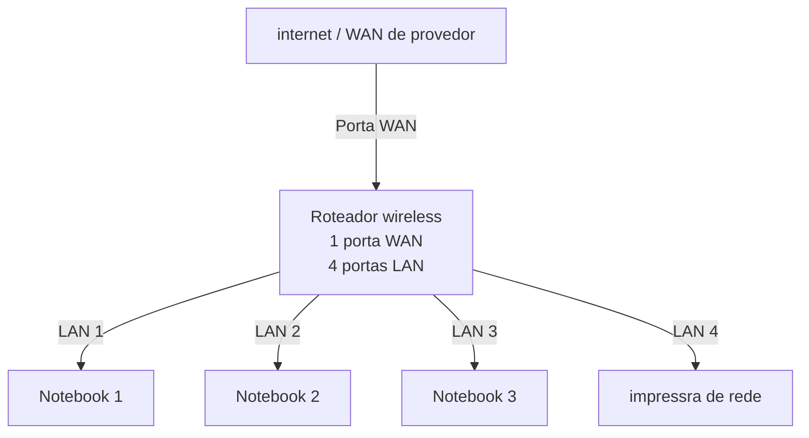
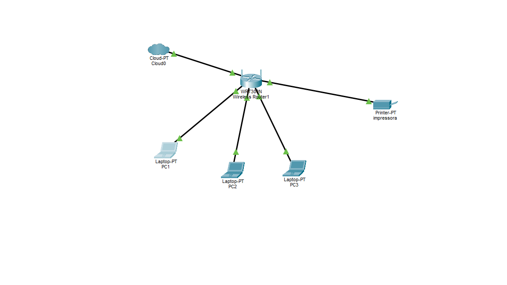

# Laboratorio de redes 01 - projetos de rede local
Projeto desenvolvido na disciplica de redes de computadores no curso tecnico de informática do Senac

aluno: Gabriel da Silva Bispo

professor: José de assis 

Data: 09/03/2025

---

##1. Objetivo
implementar uma rede local simples conectando  3  notebooks a um roteador simples com switch intergrado e uma impressora de rede.

o projeto sere realizado em duas etapas 

1. simulação da rede no cisco packet tracer
2. implementação da rede no laboratorio real

## 2. equipamentos utilizados neste laboratorio 

- 3 três notebooks
- 1 roteador wireles com 1 porta WAN e 4 portas LAN
- 1 impressora de rede

##3. Topologia da rede 
diagrama logico da rede utilizada neste laboratorio:

---

##4. plano de endereçamwento IP

Rede: 192.168.0.0/24

Gateway: 192.168.0.1

| Dispositivo | Tipo de IP | Endereço IP | Observação |
| ------------|------------|-------------|------------|
| Roteador | Estatico | 192.168.0.1 | IP do roteador |
| Impressora | Reserva DHCP | 192.168.0.100 |  IP reservado pelo roteador |
| PC1 | Reserva DHCP | 192.168.0.101 | IP reservado pelo roteador |
| PC2 | DHCP | Automatico | IP atribuido pelo roteador |
| PC3 | DHCP | Automatico | IP atribuido pelo roteador |

**Observação**

- A impressora é um do notebooks utilizam reserva DHCP.
- o Roteador sempre atribui o mesmo endereço IP a esses dispositivos.

---

##5. Implemaentação no laboratório real

após a instalação, a rede foi montada fisicamente no laboratorio 

Etapas realizadas:

(fotos e capturas de tela realizadas durante o laboratorio) 

testes:

(fotos e capturas de tela realizadas durante o laboratorio)

##6. Conclusão 

este laboratorio permitiu compreender o funcionamento de uma rede local simples, incluindo:

- Estrutura de uma rede doméstica ou pequeno escritorio
- Utilização de um roteador com porta WAN e portas LAN
- Funcionamento do DHCP
- Comunicação entre dispositivos na rede local
- Utilização de uma impressora de rede
- Compartilhamento de pastas na rede

